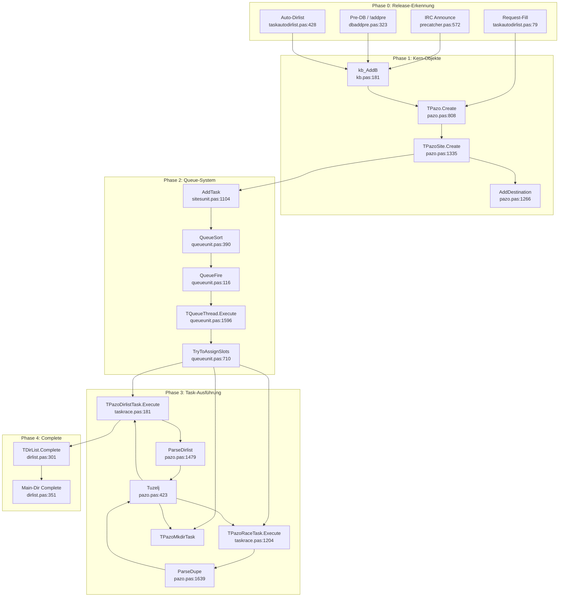
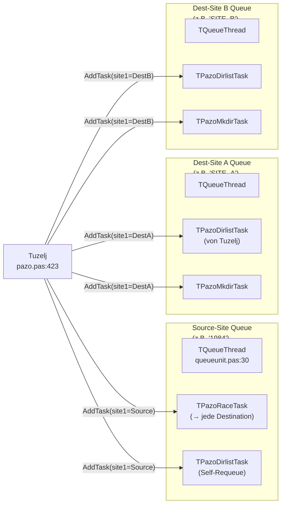
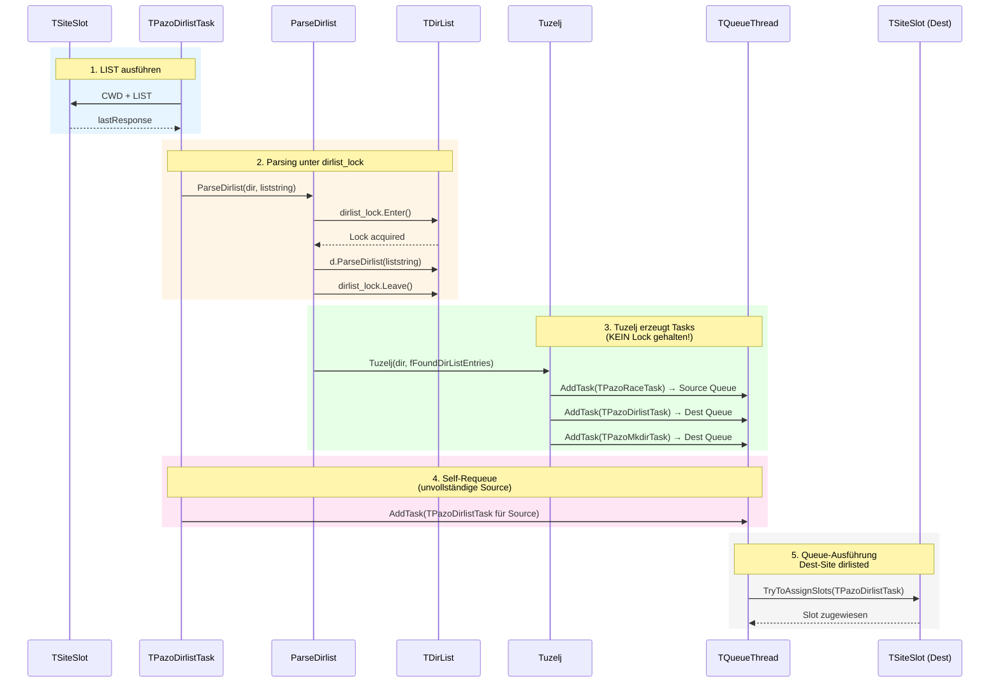
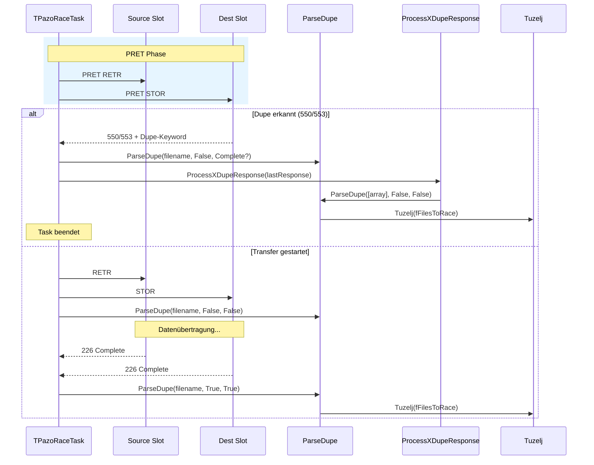
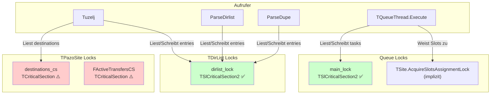

# slFTP: Queue- & Lock-Zusammenhänge — Visualisierung & Problemanalyse

> Stand: `dev_racing_time_debugging` (`0eafd612`)  
> Scope: Release-Erkennung → Queue → Dirlist → Tuzelj → Race → Complete  
> Ziel: Bild der Zusammenhänge, Identifikation von Lock-/Queue-Problemen  

---

## 1. Gesamtarchitektur — Von der Erkennung zum Complete



---

## 2. Queue-Routing — Wer landet wo?



**Kritisch:** Race-Tasks und Source-Dirlist-Tasks teilen sich **dieselbe** Queue auf der Source-Site. Das bedeutet: Wenn viele Race-Tasks oben in der Queue sitzen, werden Dirlist-Tasks der Source verzögert.

---

## 3. Der Dirlist-Loop — Sequenzdiagramm mit Locks



---

## 4. Race-Task Execute — Sequenzdiagramm mit Dupe-Erkennung



---

## 5. Lock-Landschaft

### 5.1 Lock-Typen im System

| Lock-Name | Typ | Datei | Zweck | AGENTS.md-konform? |
|-----------|-----|-------|-------|-------------------|
| `dirlist_lock` | **TSlCriticalSection2** | `dirlist.pas:133` | Schützt `TDirList.entries` | ✅ Ja |
| `main_lock` | **TSlCriticalSection2** | `queueunit.pas:23` | Schützt `TQueueThread.tasks` | ✅ Ja |
| `destinations_cs` | **TCriticalSection** | `pazo.pas:68` | Schützt `TPazoSite.destinations` | ❌ **Nein** |
| `FActiveTransfersCS` | **TCriticalSection** | `pazo.pas:56` | Schützt `FActiveTransfers` | ❌ **Nein** |
| `uid_lock` | **TSlCriticalSection2** | `tasksunit.pas` | Task-UID-Generierung | ✅ Ja |
| `queueevent` | **TEvent** | `queueunit.pas:32` | Wake-up Signal für Queue-Thread | ⚠️ OK (kein Mutex) |

### 5.2 Lock-Hierarchie & Interaktionen



---

## 6. Identifizierte Probleme

### 6.1 🟡 Queue-Clustering (Design-Feature mit Nebenwirkungen)

**Symptom:** Eine Site bekommt 2-3 Dirlist-Tasks bevor eine andere Site startet.

**Ursachen:**
1. **Self-Requeue** (`taskrace.pas:593`): Jeder unvollständige Dirlist-Lauf erzeugt sofort einen neuen Task für dieselbe Site.
2. **Break-After-First** (`taskrace.pas:611`): Die Destination-Driven-Requeue-Schleife bricht nach der **ersten** Destination ab — die Source bekommt aber trotzdem einen neuen Task.
3. **Subdir-Explosion** (`taskrace.pas:446`): Jedes entdeckte Unterverzeichnis erzeugt einen neuen Dirlist-Task für die **Source**.
4. **Sortierung nach `lastTouch`** (`queueunit.pas:380`): Alle Tasks desselben Releases clustern am Queue-Anfang.

**Konsequenz:** Eine vielbeschäftigte Source-Site monopolisiert ihre eigenen Slots mit Dirlist-Tasks, während Destinations warten.

**Mögliche Lösungsansätze (nur zur Planung):**
- `dirlistadded`-Prüfung für Source-Requeue einführen (verhindert Duplikate)
- Break-After-First aufheben oder round-robin über Destinations
- Per-site Cap auf Dirlist-Tasks pro Release
- Sort-Key erweitern, um Dirlist-Tasks verschiedener Releases zu interleaven

---

### 6.2 🔴 Lock-Verstösse gegen AGENTS.md

**Befund:** `pazo.pas` verwendet `TCriticalSection` statt `TSlCriticalSection2`:

```pascal
destinations_cs: TCriticalSection;      // pazo.pas:68
FActiveTransfersCS: TCriticalSection;    // pazo.pas:56
```

**AGENTS.md sagt:**
> Thread safety: Use `TSlCriticalSection2` from `slcriticalsection2.pas` exclusively. Never standard Pascal sync objects.

**Risiko:** `TCriticalSection` bietet kein Timeout-Monitoring. Bei einem Deadlock friert der Thread ewig ein. `TSlCriticalSection2` hat Timeout-Logging und Deadlock-Erkennung.

**Empfohlener Fix:** `TCriticalSection` → `TSlCriticalSection2` ersetzen, Constructor/Destructor anpassen.

---

### 6.3 🟡 Race Condition: `fBusyDestinations`

**Befund:** `fBusyDestinations` (ein `TDictionary<TObject, integer>`) wird in `TQueueThread.Execute` **pro Loop-Iteration neu erzeugt** (`queueunit.pas:1627`).

**Konsequenz:** Es verhindert nur, dass **in derselben Iteration** zwei Races zur selben Destination gestartet werden. Aber:
- Wenn die Queue kurz darauf erneut feuert, ist das Dictionary leer.
- Es gibt **keine** langfristige Buchhaltung, welche Destinationen bereits beschäftigt sind.
- Das kann zu übermässigen parallelen Uploads zur selben Destination führen.

---

### 6.4 🟡 Lock-Ordnung: Potential für Inversion

**Befund:** `ParseDupe` hält `dirlist_lock`, gibt ihn frei, und ruft dann `Tuzelj` auf. `Tuzelj` greift auf `destinations_cs` zu. Das ist OK (kein Nested-Lock-Problem).

Aber: `Tuzelj` kann `AddTask` aufrufen, was `main_lock` der Queue hält. `main_lock` und `dirlist_lock` sind in **verschiedenen** Threads/Sites — kein klassischer Deadlock.

**Potenzielles Problem:** Wenn `TQueueThread.Execute` gleichzeitig `TryToAssignSlots` für einen Race-Task ausführt, der `dirlist_lock` benötigt, während `ParseDirlist` gerade `dirlist_lock` hält und auf `AddTask` wartet (welches `main_lock` braucht), könnte es zu einer **lock-order inversion** kommen, wenn `main_lock` und `dirlist_lock` im selben Kontext gebraucht werden.

**Aktuelle Analyse:** Kein direkter Deadlock nachweisbar, weil `AddTask` nicht versucht, `dirlist_lock` zu erwerben. Aber die Komplexität ist hoch.

---

### 6.5 🟢 Positiv: Dirlist-Task-Limit

**Befund:** `TryToAssignSlots` limitiert Dirlist-Tasks auf `slots.Count div 2` (`queueunit.pas:774-799`).

**Das ist gut:** Es verhindert, dass eine Site komplett von Dirlist-Tasks überflutet wird und nie Races ausführt.

---

## 7. Zusammenfassung

| Problem | Schwere | Ort | Kurzbeschreibung |
|---------|---------|-----|------------------|
| Queue-Clustering | 🟡 Mittel | `taskrace.pas:593/611`, `queueunit.pas:380` | Source-Site monopolisiert eigene Queue |
| `TCriticalSection` statt `TSlCriticalSection2` | 🔴 Hoch | `pazo.pas:56/68` | Verstoss gegen Thread-Safety-Policy |
| `fBusyDestinations` nicht persistent | 🟡 Mittel | `queueunit.pas:1627` | Keine langfristige Destination-Buchhaltung |
| Lock-Order-Komplexität | 🟡 Niedrig-Mittel | `pazo.pas`/`queueunit.pas` | Hohe Anzahl verschachtelter Locks |
| Dirlist-Task-Limit | 🟢 Gut | `queueunit.pas:774` | Schützt vor Total-Überflutung |

---

*Dieses Dokument ist eine Planungs- und Analyse-Grundlage. Keine Code-Änderungen wurden vorgenommen.*
