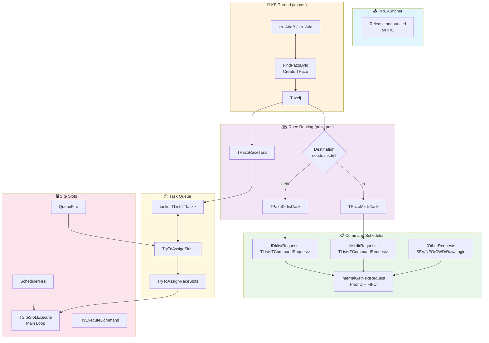
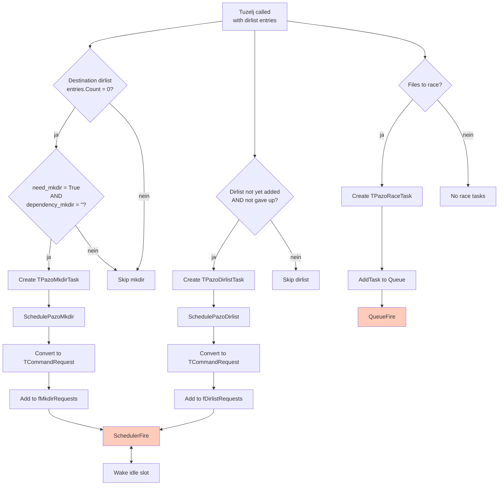
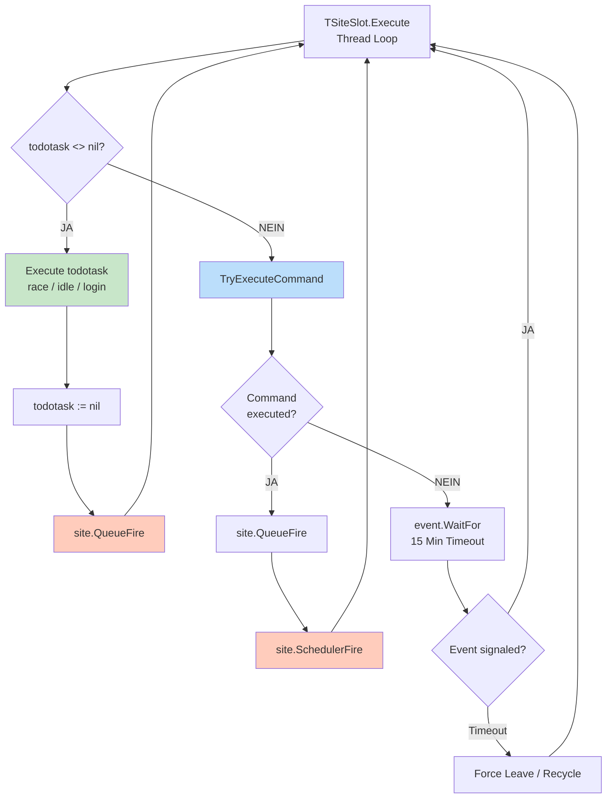
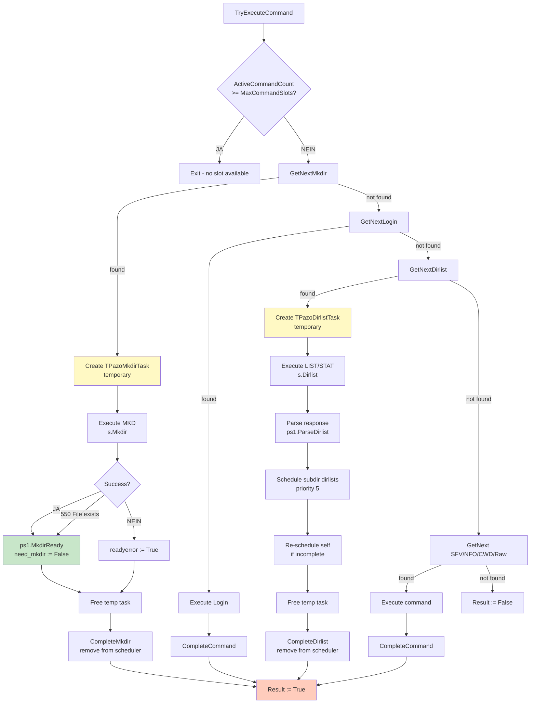
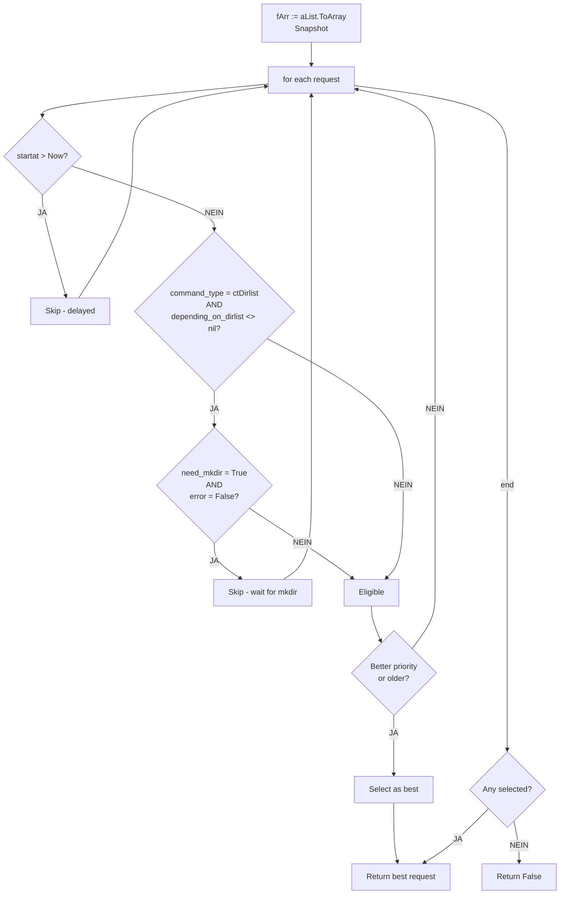
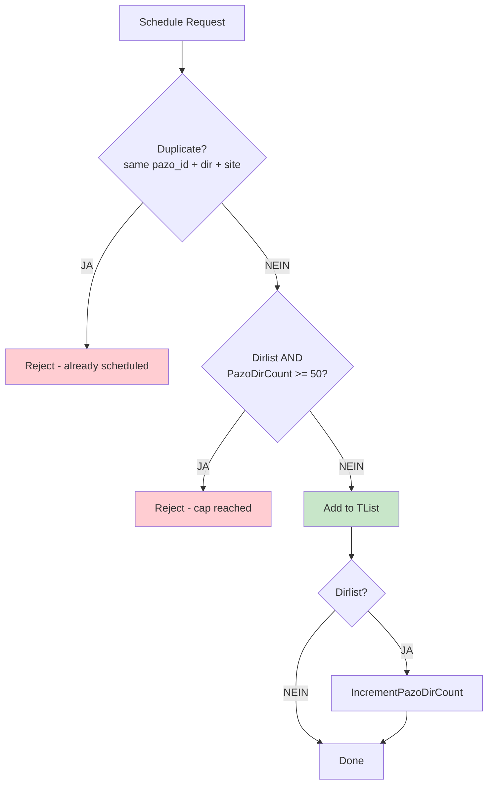
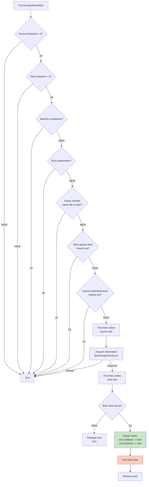
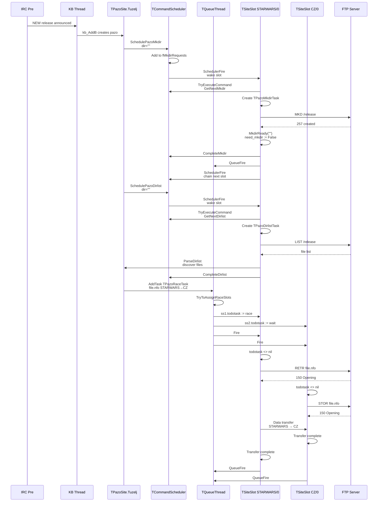
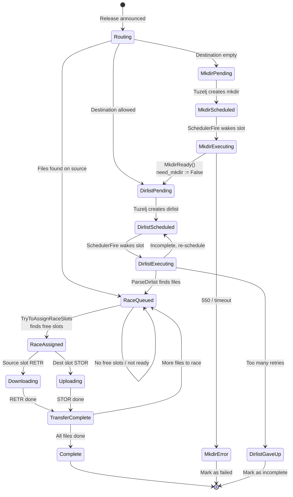
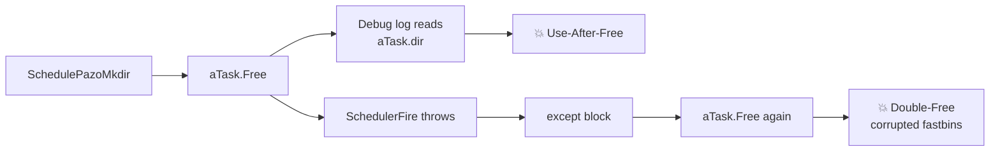

# slFTP Command Scheduler – Flow Diagram

> Branch: `feature/command-scheduler`  
> Stand: Commit `1844dfae`

---

## 1. High-Level Architektur



---

## 2. Task Creation Flow (`Tuzelj` in `pazo.pas`)



### Wichtige Details
- `TPazoMkdirTask` / `TPazoDirlistTask` Objekte werden **sofort nach dem Scheduling freigegeben** (`aTask.Free`).
- Der Scheduler speichert nur leichtgewichtige `TCommandRequest` Records.
- Race-Tasks (`TPazoRaceTask`) gehen **nicht** in den Scheduler, sondern in die traditionelle Queue.

---

## 3. Slot Execution Loop (`TSiteSlot.Execute` in `sitesunit.pas`)



### Schlüsselerkenntnis
- **Race-Tasks haben immer Vorrang** (`todotask` wird zuerst geprüft).
- Der Scheduler bekommt nur "Rest-Slots" (idle Slots ohne `todotask`).
- Nach **jedem** Arbeitsschritt (egal ob Race oder Scheduler) wird `QueueFire` aufgerufen, damit die Queue neue Race-Tasks zuweisen kann.
- Nach einem Scheduler-Command wird zusätzlich `SchedulerFire` aufgerufen, damit der nächste idle Slot den nächsten Command abarbeitet.

---

## 4. Scheduler Command Execution (`TryExecuteCommand` in `sitesunit.pas`)



### Prioritäten-Reihenfolge
1. **Mkdir** (höchste Priorität – muss vor Dirlist laufen)
2. **Login**
3. **Dirlist**
4. **SFV Download**
5. **NFO Download**
6. **CWD**
7. **Raw** (niedrigste Priorität)

---

## 5. Scheduler Internals (`commandscheduler.pas`)

### Request Selection (`InternalGetNextRequest`)



### Deduplication & Cap (`InternalAddRequest`)



---

## 6. Race Task Assignment (`TryToAssignRaceSlots` in `queueunit.pas`)



---

## 7. Komplettes Sequenzdiagramm: Release → Transfer



---

## 8. Zustandsdiagramm: Ein Release durchlaufen



---

## 9. Kritische Locks & Synchronisation

| Lock | Ort | Schützt |
|------|-----|---------|
| `fLock` | `TCommandScheduler` | Alle Request-Listen (Mkdir/Dirlist/Other) |
| `fSlotsAssignmentLock` | `TSite` | Slot-Iteration in `SchedulerFire` und `TryToAssignRaceSlots` |
| `dirlist_lock` | `TDirList` | `need_mkdir`, `entries`, `dirlistadded` |
| `kb_lock` | `kb.pas` (global) | `kb_list`, `kb_freeze` |
| `queue_lock` | `queueunit.pas` | `tasks`-Liste |
| `fActiveTransfersCS` | `TPazoSite` | `FActiveTransfers` Dictionary |

### Wake-Chain nach Command-Ausführung

```
Slot A (idle) → TryExecuteCommand → Execute Mkdir
    → CompleteMkdir
    → QueueFire  ──────┐
    → SchedulerFire ───┼──→ Slot B (idle) → TryExecuteCommand → Execute Dirlist
                        │       → CompleteDirlist
                        │       → QueueFire  ──────┐
                        │       → SchedulerFire ───┼──→ Slot C (idle) → ...
                        │                            │
                        └──→ Queue Thread wacht auf  ├──→ TryToAssignRaceSlots
                                                     │       → findet Race-Task ready
                                                     │       → weist Slot D + Slot E zu
                                                     │       → Fire D, Fire E
                                                     │
                                                     └──→ Slot D (todotask := race)
                                                              → Execute RETR
                                                              → QueueFire
```

---

## 10. Bekannte Bugs (fixed in `1844dfae`)

### Vor dem Fix


### Nach dem Fix


---

*Diagramme erstellt mit Mermaid-Syntax. In GitLab, GitHub oder VS Code mit Mermaid-Plugin renderbar.*
